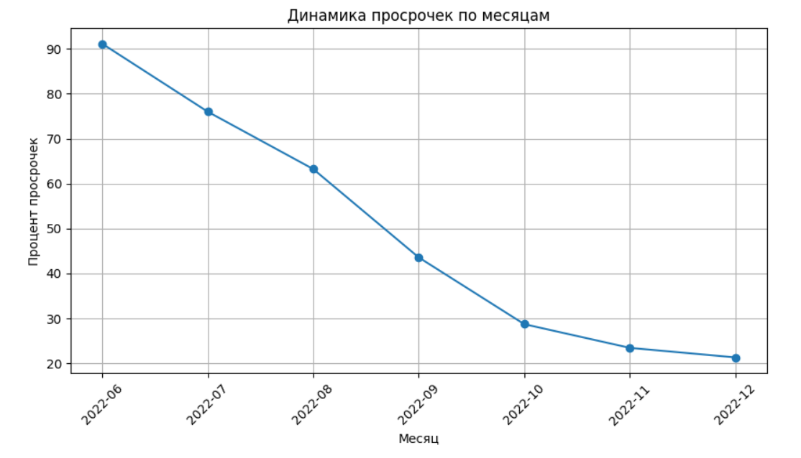

# Анализ просрочек по кредитам

## Описание проекта
Анализ динамики просроченных платежей по кредитам на основе данных о выдачах и платежах (актуально на 08.12.2022). 

**Задачи**:
- Определить тренды (рост/снижение просрочек)
- Выявить паттерны поведения клиентов
- Визуализировать ключевые метрики

## Данные
Входные данные:
- **Выдачи кредитов**: даты, суммы, статус (`orders.csv`)
- **Плановые платежи**: дата и сумма (`plan.csv`)
- **Фактические платежи**: дата и сумма (`payments.csv`)

Поля:
- `order_id`, `created_at`, `issued_sum`, `plan_at`, `paid_at` и др.

## Методы и инструменты
- **Python**: pandas, matplotlib
- **Анализ**: расчет просрочек, группировки, временные ряды

## Результаты
1. **Динамика просрочек**:
   - Наблюдается снижение процента просрочек с 91.2% в июне до 21.3% в декабре 2022
   - Наибольший процент просрочек в первые месяцы после выдачи кредита

2.  **Визуализация:**

    *   График изменения доли просрочек по месяцам
    *   Четкая отрицательная динамика просрочек

    
    
4. **Выводы**:
   - Просрочки максимальны в первые месяцы после выдачи кредита
   - К концу года процент просрочек снижается в 4.3 раза
   - Основные причины (гипотезы):
     - Клиенты лучше обслуживают долг со временем
     - Банк улучшает скоринг новых заемщиков
     - Экономическая ситуация стабилизируется
